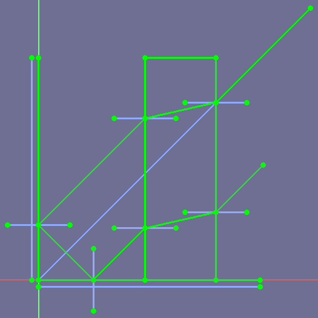
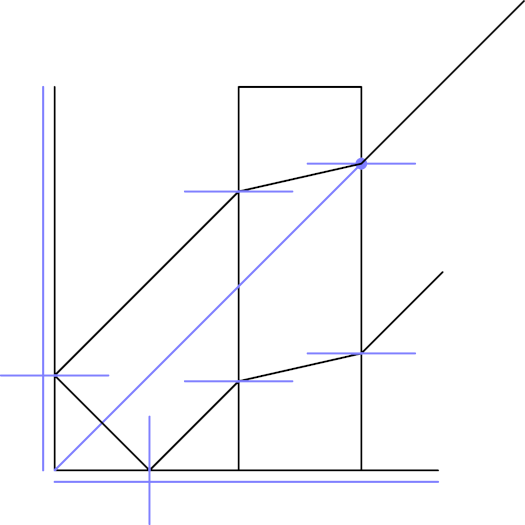
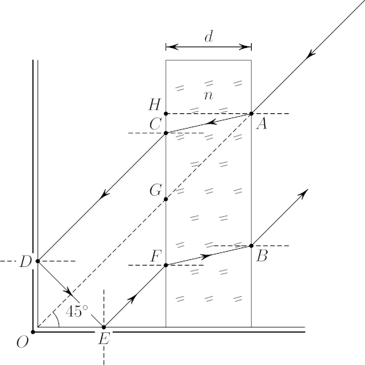

# sketch2asy
Export [**FreeCAD**](https://www.freecadweb.org/) [Sketcher SketchObject](https://wiki.freecadweb.org/Sketcher_SketchObject) to [**Asymptote**](https://asymptote.sourceforge.io/) (vector graphics language).

## Usage

* double click on a sketch or *right click > Edit sketch*;
* open ```sketch2asy.py``` in the editor (drag and drop to FreeCAD);
* go to *Marco > Execute macro* (or press *Ctrl+F6*);
* go to *View > Panels > Report view* to see the output.

## Example 

|  |  |  |
| :--------------------------------------: | :------------------------------------------: | :---------------------------------------------: |
|              FreeCAD sketch              |              Exported as *.asy               |               Modified *.asy file               |

## Other

Arcs of ellipse, hyperbola and parabola are not implemented (yet).

Tested with ```FreeCAD 0.20.1``` and ```Python 3.10.8```.